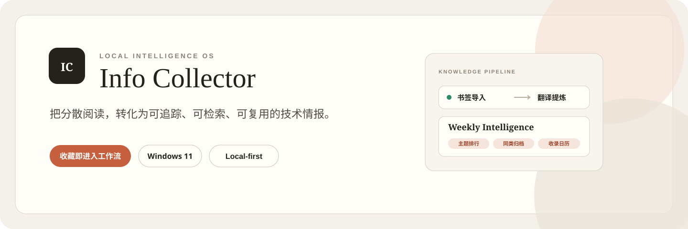
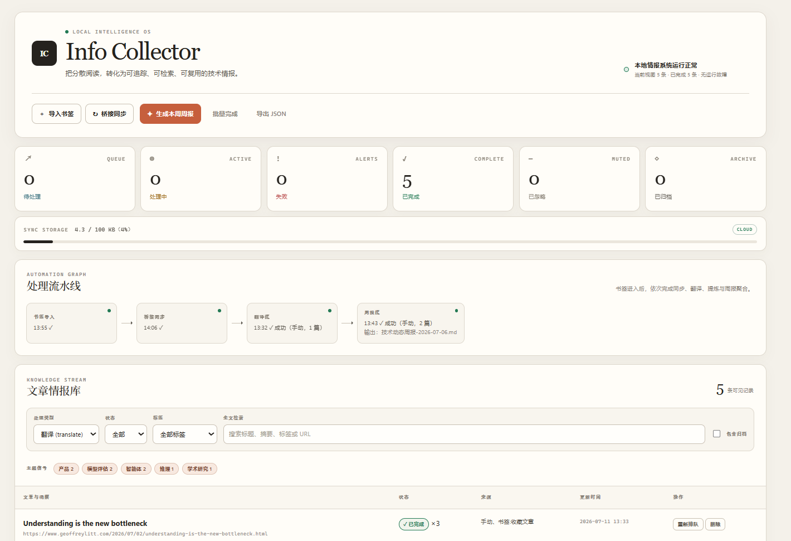
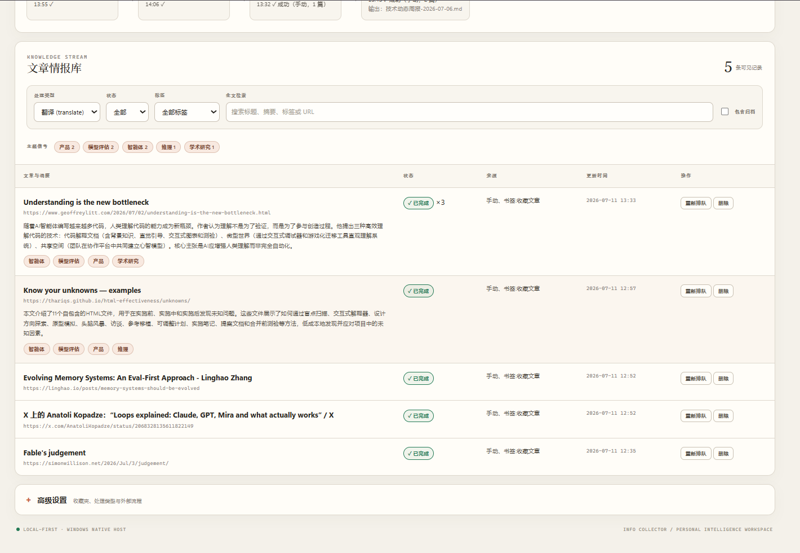
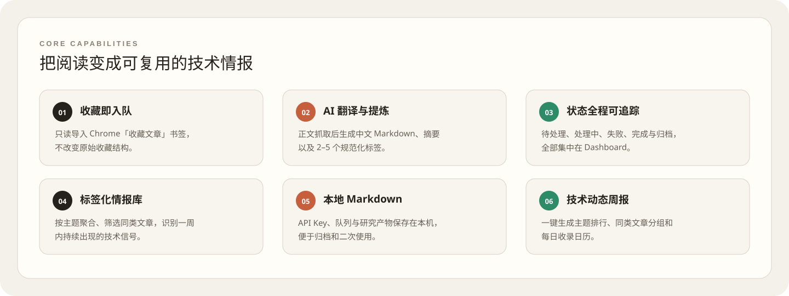
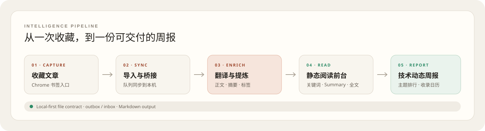
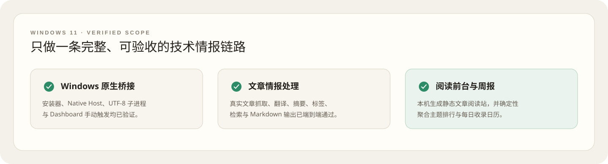
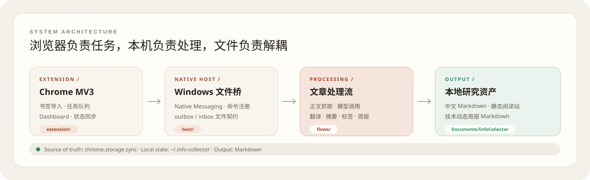
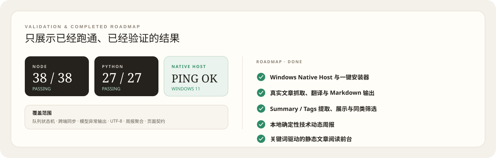

<p align="center">
  
</p>

<p align="center">
  <a href="https://madarame87.github.io/INFO/"><strong>在线体验文章情报库 →</strong></a>
</p>

<p align="center">
  <a href="SETUP-WINDOWS.md"></a>
  
  
  
  
</p>

<p align="center">
  <strong>收录文章 → 翻译提炼 → 摘要二次判断 → 收藏或完成整理 → 生成本周处理回顾</strong>
</p>

Info Collector 是一套运行在本机的个人技术情报工作台。你只需要把文章加入 Chrome 的「收藏文章」书签文件夹，系统就会把它送入处理队列，生成带有中文翻译、摘要和标签的 Markdown，并在 Dashboard 中持续记录机器处理状态。进入静态阅读库后，你可以根据摘要完成第二次人工判断：真正有价值的加入「我的收藏」，其余文章标记为「完成整理」。

它不是另一个“稍后读”列表。它把零散阅读转化为一条可追踪、可检索、可复用的研究工作流。

## 产品界面

<p align="center">
  
</p>

<details>
<summary><strong>查看文章情报库完整列表</strong></summary>
<br>
<p align="center">
  
</p>
</details>

## 它能做什么

<p align="center">
  
</p>

## 从收录到二次整理

<p align="center">
  
</p>

扩展是任务状态的唯一事实来源。本地处理流通过 `~/.info-collector/` 下的 outbox / inbox 文件契约与扩展交换数据，因此浏览器界面、模型调用与 Markdown 产物彼此解耦。

## Windows 11 快速开始

### 1. 下载并进入项目

```powershell
git clone https://github.com/Madarame87/INFO.git
cd INFO
```

### 2. 运行安装器

```powershell
powershell -ExecutionPolicy Bypass -File .\scripts\setup.ps1
```

安装器会引导你设置模型、API Key、输出目录以及 Chrome 扩展。完整截图式步骤与故障排查见 **[Windows 安装指南](SETUP-WINDOWS.md)**。

### 3. 收藏并处理文章

1. 在 Chrome 中创建「收藏文章」书签文件夹。
2. 把想处理的文章保存到该文件夹。
3. 打开 Info Collector Dashboard，依次点击「导入书签」和「桥接同步」。
4. 点击「立即处理」，完成后查看摘要、标签和本地 Markdown。
5. 点击「生成并打开阅读库」，在「待整理 / 我的收藏 / 全部收录」之间切换并完成二次整理；本周收藏会自动进入「本周精选」，可一键导出 Markdown。

## 静态文章阅读前台

阅读站由本地 Markdown 自动生成，默认输出到：

```text
%USERPROFILE%\Documents\InfoCollector\阅读站\index.html
```

索引页提供三个主视图：

- **待整理**：尚未完成人工判断的新文章；
- **我的收藏**：阅读摘要后确认值得长期保留的文章；
- **全部收录**：所有已经进入系统的文章。

关键词筛选可以和三个主视图以及「本周精选」组合使用。每张卡片都支持「收藏」「完成整理」「复制资料卡」和直接打开原文；标题仍进入完整中文译文。本周内被你点为收藏的文章会进入「本周精选」（旧文章本周重新发现也可以入选），并能导出一份含摘要、关键词和原文链接的 Markdown 清单。人工状态保存在当前浏览器 origin 的 `localStorage` 中，不会上传，也不会跨浏览器或跨设备同步。重新生成静态页面不会改变稳定文章 ID 对应的本地状态。

「复制资料卡」会生成中性的 Markdown，包含标题、原文、作者、发布时间、收录时间、关键词和摘要，便于迁移到 Obsidian 或其他笔记工具。

## 当前支持范围

<p align="center">
  
</p>

这个仓库的产品目标明确限定为 **Windows 11 技术文章整理工作流**：从 Chrome 首次收录进入队列，到本机生成结构化文章，再通过摘要完成收藏或整理判断。

## 为什么做这个项目

技术信息真正的瓶颈通常不是“找不到文章”，而是第一次保存后没有再次判断和形成可复用结构。书签会不断增长，真正重要的内容却没有被人工精选出来。

Info Collector 试图补上中间这一层：保留原文入口，同时生成统一的中文摘要与标签，让用户进行第二次判断，并把真正有用的内容迁移出去。Dashboard 的「本周处理回顾」按机器 `processedAt` 汇总，代表这周实际处理过的文章，不代表行业趋势或世界动态；阅读库里的「本周精选」则只反映你本周主动收藏的文章。两者语义分开，前者用于复盘处理量，后者用于带走真正值得保留的内容。

## 技术结构

<p align="center">
  
</p>

- 架构说明：[docs/design.md](docs/design.md)
- 领域语言：[CONTEXT.md](CONTEXT.md)
- 关键决策：[docs/adr/](docs/adr/)
- Windows 迁移清单：[docs/windows-porting-checklist.md](docs/windows-porting-checklist.md)
- 原始目标与当前产品方向自查：[docs/goal-audit-2026-07-11.md](docs/goal-audit-2026-07-11.md)

## 开发与验证

```powershell
npm.cmd test
```

当前回归覆盖 URL 归一化、队列状态机、确定性文章元数据、浏览器本地整理状态、组合筛选、资料卡复制、摘要标签、异常模型输出、周报聚合、Windows UTF-8 输出和页面契约。

## Roadmap · 已完成

<p align="center">
  
</p>

---

<p align="center">
  <sub>Local-first · Windows-native · Built for repeatable intelligence work</sub>
</p>
